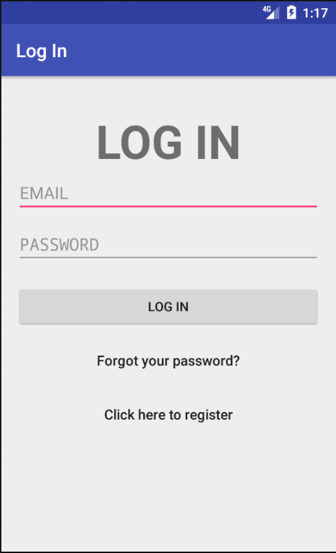

# Design Document
Hier wordt er specifiek ingegaan op hoe de technische delen van de app samenhangen. 

## LoginActivity.java
Hier wordt FireBase voor gebruikt, kan dit voor een groot deel overnemen van [Problem set 6](https://github.com/lisahabermehl/lisahabermehl-pset6). Andere activities die hierbij komen, maar gelinkt zijn:
* SignUpActivity.java
* ResetPasswordActivity.java

## MyCalendar.java
Onderdeel van deze activity worden delen van de [code die Google online heeft staan](https://developers.google.com/google-apps/calendar/quickstart/android) voor het gebruik van de Google Calendar API. 
* initialize Google credentials
* check for preconditions: device has online access, an account is selected (via Google Play?)
* request data (AsyncTask) --> List<String>
* show this information, only when user clicks on a certain date

### my_calendar.xml
Hier wordt de [CalendarView](http://abhiandroid.com/ui/calendarview) voor gebruikt, waarbij de user een popup met de TODO's van die dag te zien krijgt bij het klikken op de desbetreffende dag.

## ToDo.java
Zal voor een groot deel uit [Problem set 4](https://github.com/lisahabermehl/lisahabermehl-pset4) komen. 
* onCreate
* onCreateOptionsMenu
* onOptionsItemSelected
* updateUserInterface
* deleteToDo
## Helper.java
* SQLite shizzle

### activity_main.xml 
ListView

### to_do.xml
TextView die in de bovenstaande ListView komt te staan

## Settings.java
Nog niet helemaal uit hoe dit eruit komt te zien. User kan hier in ieder geval instellen hoe lang hij/zij over het lezen van een artikel doet. Deze gegevens worden meegenomen in het plannen van wanneer de user dit zou kunnen doen. 
