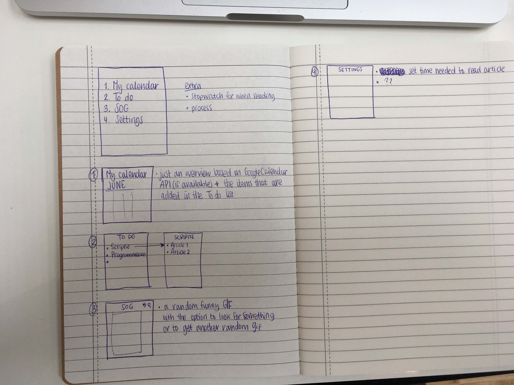

# Dit is de oude versie, de nieuwe versie staat hier: [Calendar](https://github.com/lisahabermehl/Calendar)
## Project proposal

### Goal
Deze app kan handig zijn voor mensen die het lastig vinden om schoolwerk te plannen: wat moet ik allemaal doen, hoeveel tijd ben ik er ongeveer aan kwijt en hoe zou ik dit dan moeten verdelen over mijn dagen waarbij ik rekening houd met wat ik al op de planning heb staan. Om de user hierin te helpen worden de volgende tools aangeboden:
* De app wordt gekoppeld aan een Google Calendar. Hierdoor is het makkelijker voor de user om alle dagelijkse bezigheden op één plek aan te passen. De app zal dan ook alleen de dagelijkse activiteiten kunnen lezen, er kunnen geen extra dingen worden toegevoegd. 
* Een extra feature van deze app is de To do list. Deze lijst bestaat uit hoofditems (vakken bijvoorbeeld) en daaronder subitems (de verschillende dingen die zouden moeten gebeuren - het lezen van een hoofdstuk, het lezen van een artikel, schrijven van een essay).
* In het hoofdmenu kan de user instellen hoeveel tijd hij/zij kwijt is of kwijt wilt zijn aan het lezen van een artikel of het schrijven van een essay. Bij het invoeren van de subitems kan de user aangeven waar het om gaat (een artikel, een essay) of kan de user iets nieuws toevoegen.

### Visual sketch

### How does it work?
Allereerst een inlogscherm waar de user kan inloggen met zijn/haar Google account.
Na het inloggen komt er een main screen, waar het volgende op staat:
##### My calendar
* Een overzicht van Google Calendar + items uit de list
* Door te kijken naar wat iemand al te doen heeft, wat diegene nog allemaal moet doen, wanneer dit af moet zijn en hoelang diegene er waarschijnlijk over zal doen.
##### To do
* Dit bestaat uit twee verschillende lijsten
* Een main iets zoals bijvoorbeeld “schrijven van scriptie”
* En subitems: welke artikelen moeten worden gelezen, hoeveel tijd is daarvoor nodig
##### SOG
* Hier komt standaard een random GIF te staan
* Daarnaast rechtsbovenin een optie om een bepaald soort GIF op te zoeken (happy, party etc.) en hier ook een optie om te refreshen en een andere random GIF te zien.

### APIs and such
Ik ga de GoogleCalendar API gebruiken, en als het niet teveel is ook de Giphy API. Hoe ik de data er goed in krijg, zal ik hier uit halen:
* [Google Calendar](https://developers.google.com/google-apps/calendar/quickstart/android)
* [Giphy](https://github.com/Giphy/GiphyAPI)
Ik ben van plan om een Google Calendar API te gebruiken, maar moet nog even uitzoeken of dit wel zo makkelijk is: of mensen makkelijk kunnen inloggen in hun Google Calendar in de app. En een Giphy API.

### Things to keep in mind
Waar ik op zou moeten letten is dat ik het mij niet te moeilijk maak met al deze verschillende dingen. Want het zijn wel twee verschillende API’s die ik ga gebruiken, ik weet nog niet zo goed of dit teveel kan zijn en kan leiden tot het crashen van de applicatie. In dat geval zou ik de SOG tab weglaten en hier iets anders voor moeten verzinnen.
Verder denk ik niet dat er veel problemen kunnen zijn. Maar als er iets niet lijkt te werken of als er teveel tijd in gestoken moet worden, dan denk ik dat het handig is om er dan voor te kiezen om een stapje terug te gaan en een simpele vervanging te zoeken.

### MVP and dreams
MVP is wel het My Calendar, de To do list en de Settings. Want hier draait het allemaal om. Het toevoegen van de GIFs is iets extra’s. Andere dingen die ook grappig zijn om toe te voegen is een stopwatch die een user kan gebruiken om te bepalen hoelang hij/zij bezig is met het lezen van een artikel van n pagina’s. En een progressbar: hoeveel moet de user nog doen gezien de To do list en hoeveel heeft hij/zij al gedaan (kan voor motivatie zorgen).

### Similar apps
Er zijn wel wat apps die hetzelfde doen.
#### [To-Do Calendar Planner](https://play.google.com/store/apps/details?id=com.timleg.egoTimerLight)
Zelfde als Google Calendar en daarbij is progression zichtbaar.
#### [Any.do: To-do list & Calendar](https://play.google.com/store/apps/details?id=com.anydo)
Maar deze zijn niet gericht op studenten en het studeren.
#### [Schedule Planner Classic](https://play.google.com/store/apps/details?id=com.intersog.android.schedule)
Ik zou hier wel wat ideeën uit kunnen halen als het gaat om het totale overzicht (My Calendar) en het weergeven van de To do list. Ik denk dat het zichtbare gedeelte wel overeenkomt. Alleen dat de app zelf gaat berekenen wanneer dingen gedaan moeten worden om op tijd klaar te zijn met een opdracht of met het lezen van artikelen is wel iets wat mijn app anders maakt.
